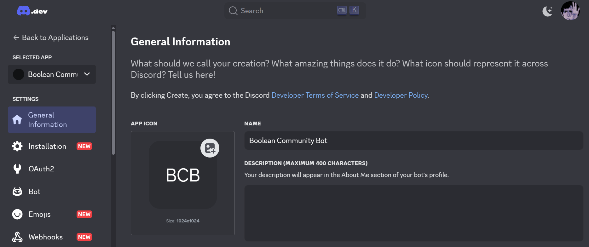
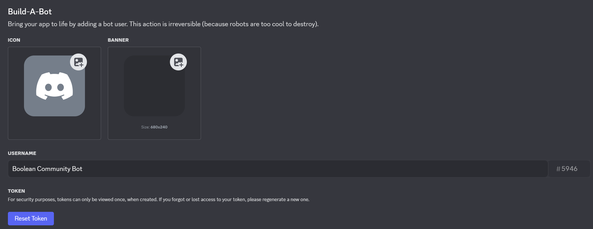

# Community bot Boolean

Segui questa guida se vuoi contribuire allo sviluppo del bot, verrai guidato passo passo nella creazione dell'ambiente di test.

## Setup

Vediamo come:

- configurare il tuo computer
- creare un account Discord developer
- ottenere un token per lo sviluppo
- creare un server Discord per testare il bot
- invitare il bot locale nel tuo server di test

## Configurazione del computer

Se sei qui probabilmente il tuo computer è già configurato a dovere, nel dubbio controlla comunque i seguenti punti:

1. Installa l'ultima versione LTS di [Node.js](https://nodejs.org/en/) (ti consigliamo di utilizzare [nvm](https://github.com/nvm-sh/nvm) o strumenti equivalenti per poter meglio gestire le versioni installate per i tuoi vari progetti)

2. Fai un fork di questo repository e clonalo in locale

3. Esegui `npm install`

## Creazione di un account Discord developer

Come ottenere il tuo account Discord Developer e creare il bot di test:

1. Registrati o fai il login (se sei già registrato) su [Discord Developer Portal](https://discord.com/developers/applications)

2. Nella dashboard, clicca _New Application_ in alto a destra

3. Scegli un nome (e.g. BooleanBot) e clicca _Create_, dovresti vedere una cosa simile 

4. Naviga nella sezione _Bot_ e clicca su _Add Bot_, dovresti vedere una cosa simile 

5. Clicca su _Reset Token_ e poi su _Copy_ **non condividere mai con nessuno il token**

6. Nel tuo editor rinomima il file `.env.example` in `.env` e aprilo, incolla il tuo token al posto di `PASTE_HERE_YOUR_TOKEN`. Attenzione a non lasciare spazi bianchi

## Creazione del server Discord di test

1. Apri Dicord e clicca sull'icona `+` sotto la lista dei server a sinistra

1. Scegli l'opzione _Create My Own_ > _For me and my friends_

## Come invitare il bot nel tuo server di test

Un bot è un utente come un altro e pertanto va invitato nel server per poterci interagire. Per farlo:

1. Vai sulla tua dashboard sul [Discord Developer Portal](https://discord.com/developers/applications/) e seleziona l'applicazione che hai creato

2. Entra nella sezione _OAuth2_e clicca su _Copy_ sotto a _CLIENT ID_

3. Vai su [Discord Permissions Calculator](https://discordapi.com/permissions.html#388208), i permessi sono già impostati

4. Incolla il _CLIENT ID_ nell'apposito campo e clicca sul link generato

5. Si aprirà una pagina con una tendina dalla quale sceglire a quale server vuoi invtare il bot, scegli il server di test che hai creato in precedenza e clicca _Authorize_. Nella lista degli utenti vedrai comparire ora il tuo bot (offline)

6. Aggiungi il tuo client ID anche al file `.env` al posto di _PASTE_HERE_YOUR_CLIENT_ID_

7. Sempre nel file `.env` incolla al posto di _PASTE_YOUR_SERVER_ID_ il server ID che puoi ottenere cliccando con il tasto destro sul nome del server in Discord. Se l'ID non compare nel menu contestuale, devi attivare la [modalità sviluppatore](https://support.discord.com/hc/en-us/articles/206346498-Where-can-I-find-my-User-Server-Message-ID)

## Mettere il bot online

Da teminale entra nella cartella del progetto ed esegui `npm run dev`, se hai fatto tutto correttamente il tuo bot risulterà online ora. Congratulazioni!
